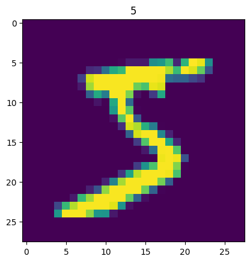

# 数据集定义与加载
深度学习模型需要大量的数据来完成训练和评估，这些数据样本可能是图片（image）、文本（text）、语音（audio）等多种类型，而模型训练过程实际是数学计算过程，因此数据样本在送入模型前需要经过一系列处理，如转换数据格式、划分数据集、变换数据形状（shape）、制作数据迭代读取器以备分批训练等。

在tensorlayerx框架中，可通过如下两个核心步骤完成数据集的定义与加载：

1. **定义数据集**：将磁盘中保存的原始图片、文字等样本和对应的标签映射到 `Dataset`，方便后续通过索引（`index`）读取数据，在 `Dataset` 中还可以进行一些数据变换、数据增广等预处理操作。在tensorlayerx框架中推荐使用 `tensorlayerx.dataflow.Dataset` 自定义数据集，另外在 `tensorlayerx.files.dataset_loaders` 目录下tensorlayerx内置了一些经典数据集方便直接调用。

2. **迭代读取数据集**：自动将数据集的样本进行分批（`batch`）、乱序（`shuffle`）等操作，方便训练时迭代读取，同时还支持多进程异步读取功能可加快数据读取速度。在tensorlayerx框架中可使用 `tensorlayerx.dataflow.DataLoader` 迭代读取数据集。

本文以图像数据集为例介绍。

## 一、定义数据集
### 1.1 直接加载内置数据集
tensorlayerx框架在 `tensorlayerx.files.dataset_loaders` 目录下内置了一些经典数据集可直接调用，通过以下代码可查看tensorlayerx框架中的内置数据集。
```{.python}
import tensorlayerx
print('计算机视觉（CV）和自然语言处理（NLP）相关数据集：', tensorlayerx.files.dataset_loaders.__all__)
```

```{.python}
计算机视觉（CV）和自然语言处理（NLP）相关数据集： ['load_celebA_dataset',
 'load_cifar10_dataset',
 'load_cyclegan_dataset',
 'load_fashion_mnist_dataset',
 'load_flickr1M_dataset',
 'load_flickr25k_dataset',
 'load_imdb_dataset',
 'load_matt_mahoney_text8_dataset',
 'load_mnist_dataset',
 'load_mpii_pose_dataset',
 'load_nietzsche_dataset']
```

从打印结果可以看到tensorlayerx内置了 CV 领域的 MNIST、FashionMNIST、Cifar10、flickr1M、flickr25k 等数据集，以及 NLP 领域的 Imdb、nietzsche等数据集。

以 MNIST 数据集为例，加载内置数据集的代码示例如下所示。
```{.python}
import tensorlayerx as tlx

X_train, y_train, X_val, y_val, X_test, y_test = tlx.files.load_mnist_dataset(shape=(-1, 28, 28, 1))
X_train = X_train * 255
```
内置的 MNIST 数据集已经划分好了训练集和测试集。

我们可构建一个子类继承自 tensorlayerx.dataflow.Dataset ，并且实现下面的三个函数：

1. `__init__`：完成数据集初始化操作，将磁盘中的样本文件路径和对应标签映射到一个列表中。

2. `__getitem__`：定义指定索引（index）时如何获取样本数据，最终返回对应 index 的单条数据（样本数据、对应的标签）。

3. `__len__`：返回数据集的样本总数。

```{.python}

from tensorlayerx.dataflow import Dataset
from tensorlayerx.vision.transforms import Normalize, Compose

class MNISTDataset(Dataset):
    """
    步骤一：继承 tensorlayerx.dataflow.Dataset 类
    """

    def __init__(self, data=X_train, label=y_train, transform=transform):
        """
        步骤二：实现 __init__ 函数，初始化数据集，将样本和标签映射到列表中
        """

        self.data_list = data
        self.label = label
        self.transform = transform

    def __getitem__(self, index):
        """
        步骤三：实现 __getitem__ 函数，定义指定 index 时如何获取数据，并返回单条数据（样本数据、对应的标签）
        """

        image = self.data_list[index].astype('float32')
        image = self.transform(image)
        label = self.label[index].astype('int64')

        return image, label

    def __len__(self):
        """
        步骤四：实现 __len__ 函数，返回数据集的样本总数
        """

        return len(self.data_list)


transform = Compose([Normalize(mean=[127.5], std=[127.5], data_format='HWC')])
train_dataset = MNISTDataset(data=X_train, label=y_train, transform=transform)
```


在上面的代码中，自定义了一个数据集类 `MNISTDataset` ， `MNISTDataset` 继承自 `tensorlayerx.dataflow.Dataset` 基类 ，并且实现了 `__init__`,`__getitem__` 和 `__len__` 三个函数。

* 在 `__init__` 函数中完成了对标签文件的读取和解析，并将所有的图像路径 `image_path` 和对应的标签 label 存放到一个列表 `data_list` 中。

* 在 `__getitem__` 函数中定义了指定 index 获取对应图像数据的方法，完成了图像的读取、预处理和图像标签格式的转换，最终返回图像和对应标签 `image`, `label。`

* 在 `__len__` 函数中返回 `__init__` 函数中初始化好的数据集列表 `data_list` 长度。

另外，在 `__init__` 函数和 `__getitem__` 函数中还可实现一些数据预处理操作，如对图像的翻转、裁剪、归一化等操作，最终返回处理好的单条数据（样本数据、对应的标签），该操作可增加图像数据多样性，对增强模型的泛化能力带来帮助。tensorlayerx框架在 `tensorlayerx.vision.transforms` 下内置了几十种图像数据处理方法，详细使用方法可参考 [数据预处理](data_processing.md) 章节。

和内置数据集类似，可以使用下面的代码直接对自定义数据集进行迭代读取。
```{.python}
from matplotlib import pyplot as plt

for data in train_dataset:
    image, label = data
    print('shape of image: ',image.shape)
    plt.title(str(label))
    plt.imshow(image[:,:,0])    
    break
```
```
shape of image:  (28, 28, 1)
```


## 二、迭代读取数据集
### 2.1 使用 tensorlayerx.dataflow.DataLoader 定义数据读取器
通过前面介绍的直接迭代读取 Dataset 的方式虽然可实现对数据集的访问，但是这种访问方式只能单线程进行并且还需要手动分批次（batch）。在飞桨框架中，推荐使用 tensorlayerx.dataflow.DataLoader API 对数据集进行多进程的读取，并且可自动完成划分 batch 的工作。
```{.python}
# 定义并初始化数据读取器
train_loader = tlx.dataflow.DataLoader(train_dataset, batch_size=64, shuffle=True)

# 调用 DataLoader 迭代读取数据
for batch_id, data in enumerate(train_loader):
    images, labels = data
    print("batch_id: {}, 训练数据shape: {}, 标签数据shape: {}".format(batch_id, images.shape, labels.shape))
    break
```
```
batch_id: 0, 训练数据shape: [64, 28, 28, 1], 标签数据shape: [64]
```

通过上述方法，初始化了一个数据读取器 train_loader，用于加载训练数据集 custom_dataset。在数据读取器中几个常用的字段如下：

* `batch_size`：每批次读取样本数，示例中 batch_size=64 表示每批次读取 64 个样本。

* `shuffle`：样本乱序，示例中 shuffle=True 表示在取数据时打乱样本顺序，以减少过拟合发生的可能。


定义好数据读取器之后，便可用 for 循环方便地迭代读取批次数据，用于模型训练了。值得注意的是，如果使用高层 API 的 `tlx.model.Model.train` 读取数据集进行训练，则只需定义数据集 `Dataset` 即可，不需要再单独定义 `DataLoader`，因为 `tlx.model.Model.train` 中实际已经封装了一部分 `DataLoader` 的功能，详细可参考 模型训练、评估与推理 章节。

注： `DataLoader` 实际上是通过批采样器 `BatchSampler` 产生的批次索引列表，并根据索引取得 `Dataset` `中的对应样本数据，以实现批次数据的加载。DataLoader` 中定义了采样的批次大小、顺序等信息，对应字段包括 `batch_size`、`shuffle`。这两个字段也可以用一个 batch_sampler 字段代替，并在 batch_sampler 中传入自定义的批采样器实例。以上两种方式二选一即可，可实现相同的效果。下面小节中介绍后一种自定义采样器的使用方法，该用法可以更灵活地定义采样规则。

## 三、总结
本节中介绍了在飞桨框架中将数据送入模型训练之前的处理流程。  
主要包括定义数据集和定义数据读取器两个步骤，另外在数据读取器中可调用采样器实现更灵活地采样。其中，在定义数据集时，本节仅对数据集进行了归一化处理，如需了解更多数据增强相关操作，可以参考 [数据预处理](data_processing.md) 章节。

以上所有数据处理工作完成后，即可进入下一个任务：模型训练、评估与推理。